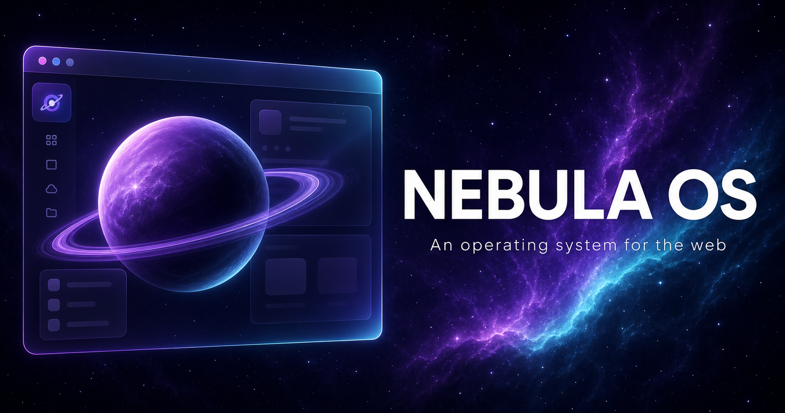

# 🪐 Nebula OS

**An operating system for the web.** A complete desktop environment that runs 100% inside a browser tab — window manager, virtual filesystem, live weather, live maps, YouTube player, code editor, beat sequencer, 8 languages, RTL support. No frameworks, no build step, no dependencies. Just HTML, CSS and vanilla JavaScript.



## ✨ Features

### Interactive desktop
- Boot sequence → desktop with **17 app icons**
- **Drag & drop icons** to rearrange them — the grid reflows live and your layout is saved
- **Pin / unpin** icons from the desktop (right-click → Unpin; right-click the wallpaper → Arrange icons restores the full set)
- **Keyboard navigation** — `Tab` / `Shift+Tab` to cycle, arrow keys to roam the grid, `Enter` to launch, `Esc` to deselect
- **Show desktop** button on the taskbar — minimizes everything, click again to restore
- Click to select, double-click to launch, right-click to rename
- **Lock screen** — optional 4-digit PIN, idle auto-lock, giant clock
- Start menu with live app search · taskbar with per-app buttons, tray & live clock
- **Alt+Tab window switcher** with app tiles · **Alt+L** to lock
- Parallax starfield wallpaper (respects reduce-motion)
- Context menus, toast notifications, glassy modal dialogs

### Window manager (`nebwm`)
- Drag by title bar (double-click to maximize)
- 8-way resize handles
- **Edge snapping** — drag to the top/left/right edge for half/full screen with a live ghost preview
- Minimize/maximize/restore animations, z-order focus

### 17 applications
| App | What it does |
| --- | --- |
| ⬛ Terminal | Multi-tab shell over the virtual FS: `ls cd cat tree find df ps top uname ping cowsay sl matrix fortune edit theme open neofetch sudo …` — arrow-key history, 25+ commands |
| 📁 Files | File manager over a **localStorage-backed virtual filesystem** — breadcrumbs, folders, viewers |
| ⌨️ Code Editor | Syntax highlighting (JS/CSS/HTML/JSON), create/save files to the FS, Ln/Col status, Tab insert |
| 📝 Notes | Multi-note editor with autosave |
| 🎨 Paint | Canvas drawing — brushes, colors, eraser, save as PNG |
| 🎛️ Beat Deck | **16-step Web Audio sequencer** — program kick/snare/hat/bass, tempo, live playback |
| 🌐 Nebula Web | Built-in browser with internal start page, history, new-tab fallback |
| ▶️ YouTube | Plays any watch/shorts/youtu.be/playlist link via the official embed player — oEmbed title + author metadata, thumbnails, **Recently played** history |
| 🗺️ Maps | Live OpenStreetMap with **geocoded search** (type any address, get results chips), 10 city shortcuts, geolocation, open-full-map |
| 🧮 Calculator | Expression calculator with keyboard support and history |
| 🕰️ Clock | Analog + digital, **world clocks**, stopwatch with laps, countdown timers |
| 🌦️ Weather | **Live weather** (Open-Meteo, no API key) — 12 cities, geolocation, 24h forecast, offline cache |
| 📊 System Monitor | Animated CPU/RAM charts + live process table |
| 📅 Calendar | Month grid with navigation |
| 🐍 Snake | Classic Snake — arrow/WASD, speed-up, persistent high score |
| ⚙️ Settings | Theme, accent color, 6 wallpapers, sound, reduce motion, **language (8)**, PIN, idle lock, reset |
| 🪐 About | System info & shortcuts |

### World-class details
- **8 languages** — English, Español, Français, Deutsch, Português, 日本語, हिन्दी, العربية (**RTL**) — switch live in Settings
- Web Audio UI sounds + boot chime, all optional
- Everything persists in `localStorage`; **Settings → Reset workspace** wipes it clean
- `df` in the terminal reports your *actual* localStorage usage
- Console API: `Nebula.openApp('snake')`, `Nebula.FS.list('/home/guest')`, `Nebula.OS.setLanguage('ja')`

## ⌨️ Shortcuts
| Keys | Action |
| --- | --- |
| `Alt + Tab` / `Alt + Shift + Tab` | Cycle open windows |
| `Alt + L` | Lock the screen |
| `Esc` | Close menus / switcher |

## 🖥️ Run it locally
```bash
# it's a static site — just open it
open index.html            # macOS
xdg-open index.html        # Linux

# or serve it
python3 -m http.server 8080
```

## 🚀 Deploy to GitHub Pages
1. Push this folder to a repo (e.g. `nebula-os`).
2. **Settings → Pages → Build and deployment → Source: Deploy from a branch** → `main` / `(root)`.
3. Your OS lives at `https://<you>.github.io/nebula-os/`.

## 📁 Project structure
```
index.html        page skeleton (boot, desktop, lock screen, taskbar, alt-tab)
css/style.css     the entire design system (glassmorphism, themes, all apps)
js/fs.js          virtual filesystem (in-memory tree, localStorage persistence)
js/i18n.js        8-language UI dictionary + RTL
js/os.js          kernel: window manager, lock, alt-tab, parallax, i18n, idle
js/apps.js        terminal, files, notes, paint, beat deck, browser, monitor, calendar, settings, about
js/apps-extra.js  calculator, clock, code editor, weather, snake, youtube, maps
```

## 🛠️ Console API
```js
Nebula.openApp('terminal')
Nebula.openApp('weather')
Nebula.FS.list('/home/guest')
Nebula.OS.setLanguage('ar')   // instant RTL
Nebula.lockScreen()
```

---
*Made with ♥ in the browser. v1.2.0*
